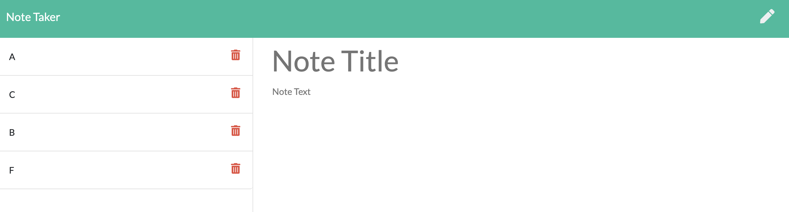

# Note_taker

<br>

# Summary

This is an app that allows a user to write, save and delete notes. It uses an Express backend and saves/retrieves note data from a JSON file.
<br>

# Sample Images


<br>

# Technologies

- HTML
- CSS
- VScode
- Git
- GitHub
- Javascript
- Express

# Author

Arman Riahi

# Links

[LinkedIn](https://www.linkedin.com/in/arman-riahi/)
<br>

[GitHub](https://github.com/namrataffy)
<br>

# Code Snippet

Code showing how api route for notes is made:

```
 app.get("/api/notes", function(req, res) {
  let theJSON = null;
  fs.readFile("./db/db.json", function(err, data) {
    console.log(data);
    if (err) return console.error(err);
    theJSON = JSON.parse(data);
    res.json(theJSON);
  });
});
```
